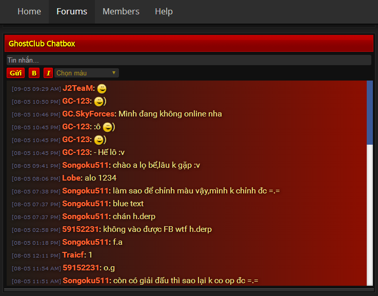

# XenForo J2TeaM Chatbox

A chatbox add-on for XenForo

## Screenshot

## Installation

1. Download the add-on and unzip it.
2. Upload the add-ons files into your XenForo installation. This will usually create a new directory within the library/ directory in your XenForo installation. In general, this shouldn't overwrite any existing files.
3. From your Admin Control Panel, go to the "Install New Add-on" page. The add-on will have provided an XML file somewhere within it. Upload that file there and submit the form.

## Usage

The add-on will disable by default, because you need to set the Firebase URL.

From your Admin Control Panel:

1. Go to Options > J2TeaM Chatbox.
2. Enter your Firebase URL. If you don't have one, [click here](https://www.firebase.com/signup/) to get!
3. Check the Enable option to make it display on the forum.

## Contributing

1. Fork it!
2. Create your feature branch: `git checkout -b my-new-feature`
3. Commit your changes: `git commit -am 'Add some feature'`
4. Push to the branch: `git push origin my-new-feature`
5. Submit a pull request :D

## Credits

- [Firebase](https://www.firebase.com/) by Google.
- [Moment.js](http://momentjs.com/)
- jQuery CSSEmoticons by @JangoSteve.
- xBBCode by @patorjk.

## License

[MIT LICENSE](LICENSE).